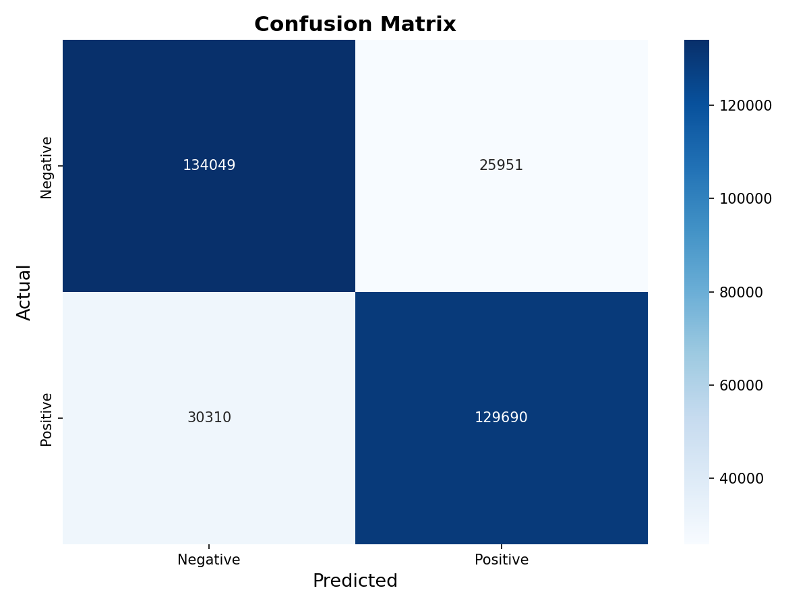
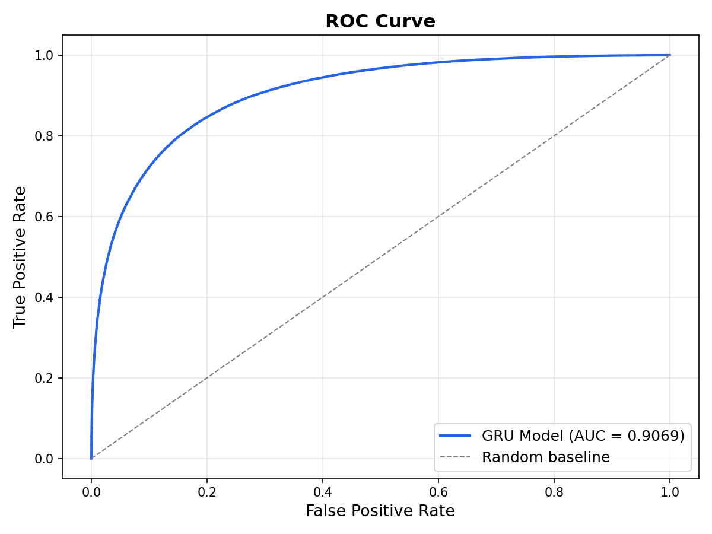
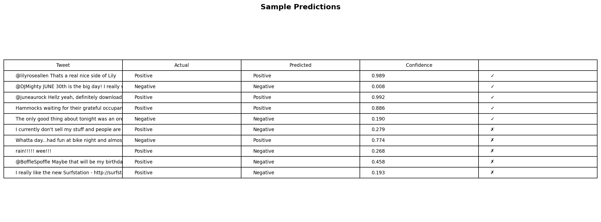

# Twitter Sentiment Analysis


A deep learning pipeline for classifying tweets as **Positive** or **Negative** using a GRU-based recurrent neural network, trained on **1.6 million tweets** from the [Sentiment140](http://help.sentiment140.com/for-students) dataset.

---

## Overview

| Item | Detail |
|------|--------|
| **Task** | Binary Sentiment Classification |
| **Dataset** | Sentiment140 — 1,600,000 tweets |
| **Model** | GRU (Gated Recurrent Unit) |
| **Framework** | TensorFlow / Keras |
| **Demo** | Gradio Web Interface |

---

## Architecture

```
Input Text
    |
    v
[ Text Preprocessing ]  lowercase -> remove URLs/mentions -> clean -> tokenize -> pad
    |
    v
[ Embedding Layer ]      vocab_size=5000, embedding_dim=128
[ Dropout (0.3)   ]
[ GRU (100 units) ]      dropout=0.2
[ Dense (sigmoid) ]      1 unit -> probability
    |
    v
Positive / Negative
```

---

## Results

| Metric | Score |
|--------|-------|
| **Test Accuracy** | 82.42% |
| **Test F1-Score** | 82.18% |
| **ROC AUC** | 0.9069 |
| **Epochs** | 7 |
| **Batch Size** | 64 |

### Confusion Matrix



### ROC Curve



### Sample Predictions



### Training Progress

| Epoch | Train Acc | Val Acc | Val Loss |
|-------|-----------|---------|----------|
| 1 | 78.57% | 81.64% | 0.4006 |
| 2 | 81.74% | 82.19% | 0.3908 |
| 3 | 82.43% | 82.35% | 0.3900 |
| 4 | 82.71% | 82.43% | 0.3879 |
| 5 | 82.96% | 82.49% | 0.3883 |
| 6 | 83.12% | 82.48% | 0.3882 |
| 7 | 83.16% | 82.44% | 0.3894 |

---

## Project Structure

```
Tweets-Sentiment-Analysis/
|
├── EDA.ipynb              # Exploratory Data Analysis & data cleaning
├── train.ipynb            # Model training notebook
├── preprocessing.py       # Text cleaning & tokenization utilities
├── evaluate.py            # Model evaluation (metrics + plots)
├── app.py                 # Gradio demo web interface
|
├── results/               # Generated evaluation plots
│   ├── confusion_matrix.png
│   ├── roc_curve.png
│   ├── sample_predictions.png
│   └── metrics.txt
|
├── sentiment_model.h5     # Trained GRU model (not in git)
├── tokenizer.pkl          # Fitted tokenizer (not in git)
├── requirements.txt       # Python dependencies
├── .gitignore
├── LICENSE
└── README.md
```

---

## Getting Started

### Prerequisites
- Python 3.10+
- pip

### Installation

```bash
git clone https://github.com/YOUR_USERNAME/Tweets-Sentiment-Analysis.git
cd Tweets-Sentiment-Analysis

python -m venv venv
source venv/bin/activate        # Linux/Mac
venv\Scripts\activate           # Windows

pip install -r requirements.txt
```

### Run the Demo

```bash
python app.py
```
Open http://localhost:7860 in your browser.

### Run Evaluation

```bash
python evaluate.py
```
Results (plots + metrics) will be saved to the `results/` folder.

### Train from Scratch

1. Download the [Sentiment140 dataset](http://help.sentiment140.com/for-students) and place it as `data.csv`
2. Run `EDA.ipynb` to generate `clean_data.csv`
3. Run `train.ipynb` to train the model

---


## Future Improvements

- [ ] Add LSTM and BiLSTM models for comparison
- [ ] Experiment with pre-trained embeddings (GloVe, Word2Vec)
- [ ] Fine-tune a Transformer model (BERT / DistilBERT)
- [ ] Add multi-class sentiment (Positive / Neutral / Negative)
- [ ] Deploy to Hugging Face Spaces for a live demo
- [ ] Add unit tests for preprocessing pipeline
